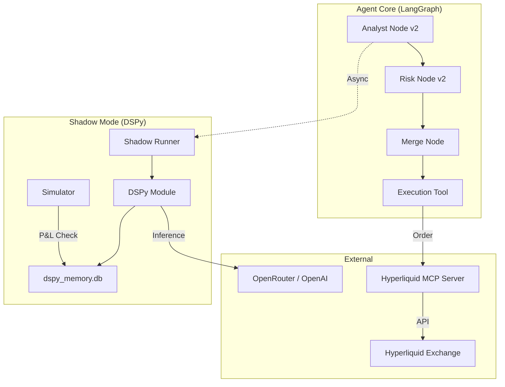

# Hyperliquid Agentic Trading System - Codebase Overview

## Project Summary

This project is an advanced **Agentic Trading System** built on top of the Model Context Protocol (MCP). It features a **Dual-AI Architecture** where a legacy LangGraph agent manages live capital while a "Shadow Mode" DSPy agent mimics the process to learn and optimize strategies without risk.

---

## 🏗️ Architecture



---

## 📂 Project Structure

```
hyperliquid-mcp-agent/
├── .env                        # Credentials (Private)
├── agent/                      # PRINCIPAL AGENT CODE
│   ├── nodes/                  # LangGraph Nodes
│   │   ├── analyst_v2.py       # Market Analysis (3-Phase)
│   │   ├── risk_v2.py          # Risk Management
│   │   └── merge.py            # Signal Synthesis & Execution
│   ├── dspy/                   # SHADOW MODE CODE
│   │   ├── modules.py          # DSPy Modules (ShadowTrader)
│   │   ├── signatures.py       # Typed Signatures
│   │   └── simulator.py        # P&L Simulation Layer
│   ├── models/                 # Shared Pydantic Schemas
│   │   └── schemas.py          # TradeSignal, RiskDecision
│   ├── db/                     # Persistence
│   │   ├── dspy_memory.py      # Shadow DB Models
│   │   └── repository.py       # Live DB Access
│   ├── dspy_runner.py          # Async Shadow Orchestrator
│   ├── main.py                 # Application Entry Point
│   └── telegram.py             # Notification System
├── deployment-test/            # MCP SERVER CODE
│   └── server.py               # Core MCP Tools
└── README.md                   # Setup Guide
```

---

## 🧩 Core Components

### 1. Principal Agent (Live Trading)

- **Analyst (`analyst_v2.py`)**: Fetches 5m/1h/4h/1d candles and performs a 3-phase analysis (Memory -> Fetch -> LLM).
- **Risk Manager (`risk_v2.py`)**: Validates signals against account equity, leverage limits, and "Bear Trend" safety rules.
- **Merge Node (`merge.py`)**: Synthesizes the decision. Converts absolute risk prices (SL/TP) into execution percentages.

### 2. Shadow Mode (Optimization)

- **Goal**: Create a labeled dataset (Signal + Outcome) to train a better prompt (MIPROv2).
- **Runner (`dspy_runner.py`)**: Runs asynchronously after the main cycle.
- **Module (`modules.py`)**: Uses `dspy.Predict` with Assertions (`dspy.Suggest`) to explore self-correction.
- **Simulator (`simulator.py`)**: Tracks "Paper Trades" and calculates P&L based on real market moves.

### 3. MCP Server (`deployment-test/server.py`)

- Acts as the **Device Layer**.
- Exposes secure tools (`place_smart_order`, `get_candles`) to the agent.
- Handles signing and API connectivity.

---

## 💾 Data Persistence

The system uses **SQLite** for robust local storage:

| Database      | File             | Purpose                                                     |
| ------------- | ---------------- | ----------------------------------------------------------- |
| **Live DB**   | `agent.db`       | Real trade history, User actions, Logs.                     |
| **Shadow DB** | `dspy_memory.db` | Shadow trades, P&L simulation results, Optimization traces. |

---

## 🔔 Notifications

Integrated **Telegram** alerts (`telegram.py`) for:

- **Live Trades**: Execution confirmations.
- **Shadow Trades**: Ghost-themed alerts (`👻 SHADOW TRADE OPENED`) to visualize what the optimizee is thinking.
- **Errors**: Critical failure alerts.

---

## 🛠️ Configuration (`agent/config.py`)

Key settings managed via `.env`:

- `OPENROUTER_API_KEY`: For flexible model selection (e.g., DeepSeek, Claude 3.5).
- `OPENROUTER_BASE_URL`: API Endpoint.
- `ANALYST_MODEL`: Model ID for market analysis.
- `FOCUS_COINS`: List of assets to trade (e.g., `["BTC"]`).
