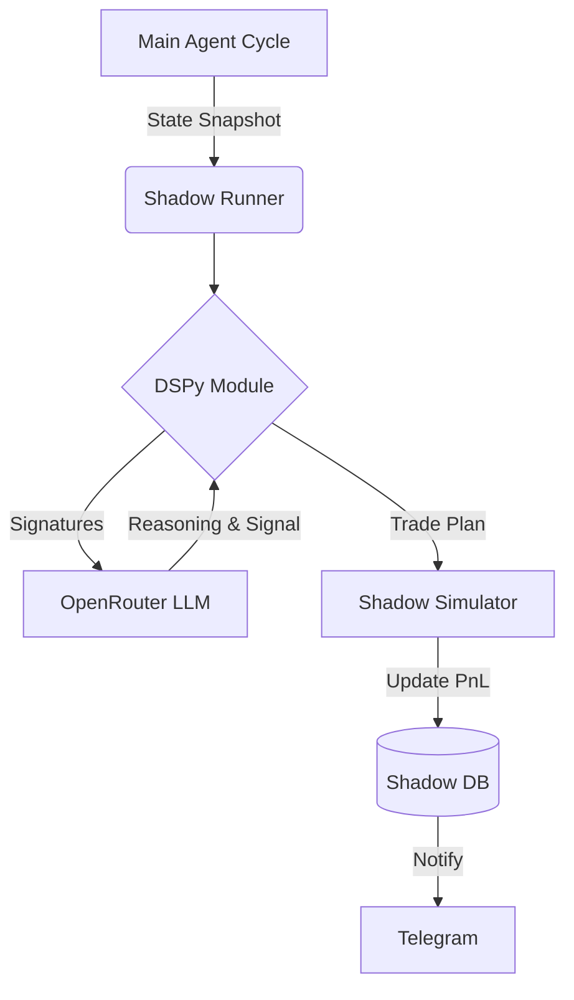

# DSPy Shadow Mode Implementation Guide

## 1. Overview

**Shadow Mode** runs a secondary, experimental AI trading agent in parallel with the main "Legacy" agent. It uses **DSPy (Declarative Self-Improving Python)** to structure its reasoning and optimize its prompts over time.

### Core Philosophy

- **Zero Risk**: It does not execute real trades. It simulates them against live market data.
- **Aggressive Experimentation**: It is configured to be more active and risk-tolerant than the main agent, allowing us to test new strategies (e.g., counter-trend, scalp) without losing money.
- **Independent State**: It tracks its own "Shadow Equity", fees, and slippage, completely separate from the real exchange account.

---

## 2. Architecture: The "Sidecar" Pattern

The Shadow Agent runs as a non-blocking background task ("fire-and-forget") attached to the main agent's inference cycle.



### Key Components

| Component     | File                       | Responsibility                                                                      |
| ------------- | -------------------------- | ----------------------------------------------------------------------------------- |
| **Runner**    | `agent/dspy_runner.py`     | Entry point. Receives state, initializes DB, runs inference, handles notifications. |
| **Module**    | `agent/dspy/modules.py`    | Contains the `ShadowTrader` logic and **Assertions** (self-correction rules).       |
| **Signature** | `agent/dspy/signatures.py` | Defines the input/output interface (Prompt) for the LLM.                            |
| **Simulator** | `agent/dspy/simulator.py`  | Simulates fill prices, fees (`0.06%`), slippage (`0.01%`), and PnL.                 |
| **Memory**    | `agent/db/dspy_memory.py`  | SQLModel database definitions for independent shadow state.                         |

---

## 3. Detailed Data Flow

### Step 1: State Injection (`agent/main.py`)

At the end of every 3-minute cycle, the main agent creates a background task:

```python
# Pass the EXACT same market data the main agent saw
asyncio.create_task(run_shadow_cycle(result, tools))
```

### Step 2: Independent Account Tracking (`agent/dspy_runner.py`)

The runner first ensures the Shadow Account exists.

- If fresh, it copies the **Real Exchange Equity** as its starting balance.
- If existing, it uses its own **Shadow Equity** (which grows/shrinks based on simulated performance).

### Step 3: DSPy Inference (`agent/dspy/modules.py`)

The `ShadowTrader` module processes the inputs. It uses **Assertions** to enforce logic:

- _Example Assertion:_ "If Confidence > 50%, you MUST define an Entry Price."
- _Example Assertion:_ "If Bearish Trend, do not Long unless confidence > 65%."
  If the LLM violates these, DSPy automatically rewrites the prompt with the error ("suggestion") and retries.

### Step 4: Simulation (`agent/dspy/simulator.py`)

- **Open Trades:** On every cycle, the simulator checks active shadow trades against the current price.
- **Execution:** Used `entry_price` is generally the market close (unless limit hit).
- **Fees & Slippage:**
  - **Fees:** `0.06%` round trip (simulating taker fees).
  - **Slippage:** `0.01%` per side (simulating real-world friction).
- **Closure:** If SL/TP is hit, the trade is closed, and `ShadowAccountState` is updated.

---

## 4. Database Schema (`dspy_memory.db`)

This generic SQLite database is persisted in the Docker volume `agent_data`.

### `ShadowAccountState` Table

Tracks the agent's virtual bankroll.

```python
class ShadowAccountState(SQLModel, table=True):
    initial_equity: float  # Starting point
    current_equity: float  # Diverges from real world
    total_pnl: float
    total_fees: float
    total_slippage: float
    winning_trades: int
    losing_trades: int
```

### `ShadowTrade` Table

Records every signal and its outcome.

```python
class ShadowTrade(SQLModel, table=True):
    signal: str          # LONG / SHORT
    confidence: float    # 0.0 - 1.0
    reasoning: str       # Full LLM thought process

    # Financials
    entry_price: float
    exit_price: float
    pnl_usd: float
    fees_usd: float      # Simulated cost

    # Context (For Optimization)
    full_prompt_trace: str # JSON dump of the exact prompt + inputs
```

### `OptimizationExample` Table

(Future Use) High-quality trade examples (e.g., >5% profit) are saved here to "train" the DSPy optimizer (MIPROv2) later.

---

## 5. Optimization & Tuning

The prompts are located in **`agent/dspy/signatures.py`**.
We recently optimized them to be:

1.  **Aggressive:** "Shadow Mode Goal: Test experimental setups. Be aggressive."
2.  **Action-Oriented:** "Prefer ACTION over HOLD."

### How to Tweak

- **To change behavior:** Edit `agent/dspy/signatures.py`.
- **To change safety rules:** Edit `agent/dspy/modules.py` (Assertions).
- **To change simulated costs:** Edit `agent/dspy_runner.py` (`SIMULATED_FEE_RATE`) or `agent/db/dspy_memory.py` (`SLIPPAGE_RATE`).

## 6. Monitoring

Notifications are sent to Telegram via `notify_shadow_trade_opened` and `notify_shadow_trade_closed`.

- **Ghost Emoji 👻:** Indicates a Shadow Mode notification.
- **Stats:** Includes separate Equity, Fees, and real-time PnL.
